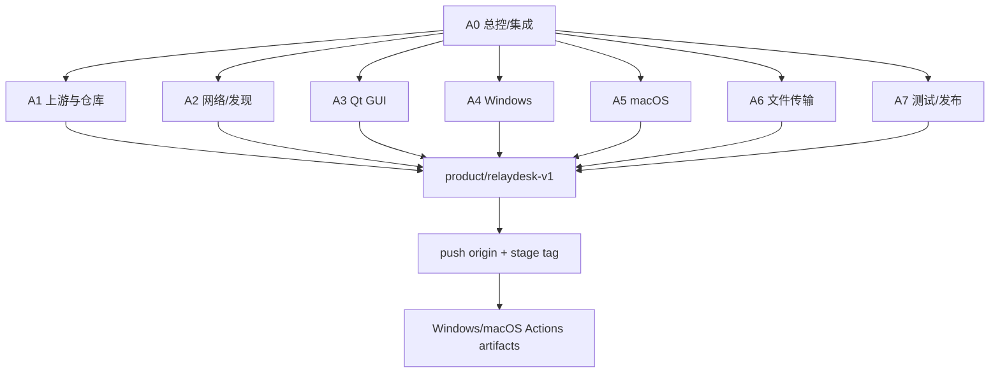

# 00 总控开发计划

## 1. 目标

在 Deskflow v1.26.0 上以最小侵入方式完成 RelayDesk，优先做出可安装、可联调、可传文件的内部版本。

## 2. 执行模式

用户只做最终验收。A0 自动完成：

```text
当前 GitHub 仓库识别
→ 获取/导入上游源码
→ 创建产品分支并推送
→ 准备 Windows/macOS 环境或 CI 回退
→ 多代理并行开发
→ 小功能提交
→ 阶段合并与推送
→ 双平台打包
→ 最终验收包
```

阶段是工作排序，不是人工审批或阻塞式门禁。共享接口、GUI 骨架、平台调查和测试可在不冲突时并行推进。

## 3. 不做什么

- 账号、登录、云端后台；
- 管理员门户、RBAC、租户；
- 公网中继、手机端、远程桌面、远程命令；
- 文件内容扫描、DLP、复杂安全平台；
- 强制 PR、双人审核、required checks、覆盖率阈值；
- 真正跨 Windows OLE 与 macOS 原生拖拽会话的状态延续。

## 4. 并行执行模型



## 5. Phase 0：自动仓库与原版基线

1. 保留现有 `origin`；
2. 添加 `upstream`；
3. 获取 `v1.26.0` 并验证 `760e3b9`；
4. 创建/恢复 `product/relaydesk-v1`；
5. 安装开发资料、提交并推送；
6. Windows/macOS 原版构建；
7. 本机环境缺失时使用 GitHub Actions；
8. 条件允许时执行双向键鼠和剪贴板真机联调；
9. 记录实际模块、target、构建命令和 artifact。

Phase 0 的本地真机项暂不可执行时标记 `NOT_RUN`，不阻止独立功能开发和 CI 构建。

## 6. Phase 1：产品基础

- 品牌集中配置；
- 中文 i18n；
- 设备发现与在线状态；
- 简单配对与本地信任；
- 自动重连；
- 设备卡片与布局。

阶段完成：提交所有小切片，合入集成分支，推送远程并生成双平台 build artifact。

## 7. Phase 2：文件传输闭环

第一条纵向切片：

```text
设备 A 选择文件
→ Offer
→ 设备 B 接收
→ 独立连接流式发送
→ .part
→ 完整性校验
→ 原子完成
→ UI 成功状态
```

随后扩展多文件、文件夹、暂停、取消、续传、冲突和历史。

## 8. Phase 3：可靠性与 UI

- 设备卡片拖放；
- 传输中心；
- 速度/ETA；
- 重名策略；
- 睡眠/唤醒；
- 磁盘不足和权限错误；
- 日志与诊断。

## 9. Phase 4：双平台发布

### Windows

- 自动安装/复用 MSVC、CMake、Ninja、Qt、OpenSSL/vcpkg、WiX；
- Release build/test；
- 7Z + WiX 安装包；
- unsigned 内部发布；
- artifact/Release 上传。

### macOS

- 自动安装/复用 Xcode CLI、CMake、Ninja、Qt、OpenSSL；
- Apple Silicon Release build/test；
- `.app` + `.dmg`；
- ad-hoc/unsigned 内部发布；
- artifact/Release 上传。

## 10. Git 节奏

- 每个可独立验证的小功能立即提交；
- 共享接口提交后立即推送代理分支，供另一平台同步；
- 每个阶段结束由 A0 合并到 `product/relaydesk-v1`；
- 更新状态文档；
- 推送集成分支和阶段标签；
- 触发双平台 Actions；
- 记录 artifact 与 SHA-256。

PR 不是前置条件；不启用强制审核和分支保护。

## 11. 失败处理

- 本机依赖安装失败：切换 GitHub Actions runner；
- 单平台暂不可运行：继续共享核心和另一平台，不伪造 PASS；
- 推送短暂失败：保留提交并重试，不要求用户手工推送；
- 签名凭据缺失：交付 unsigned 包；
- macOS 系统权限未授权：构建不停止，运行验证列入最终验收；
- 冲突：A0 以远程集成分支为准，最小化解决并记录。
