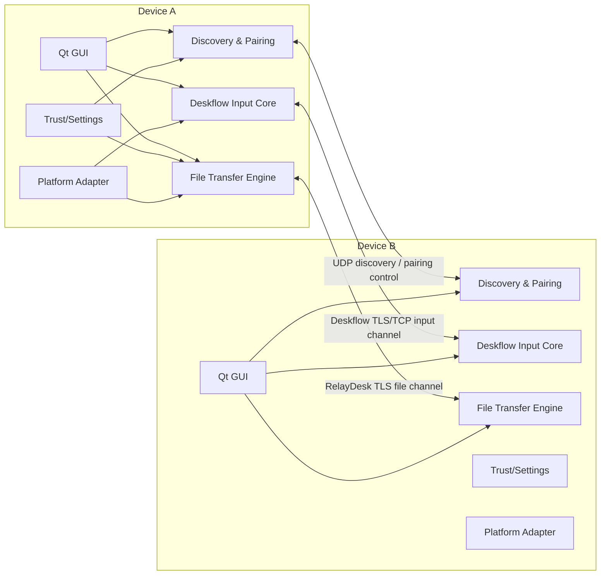
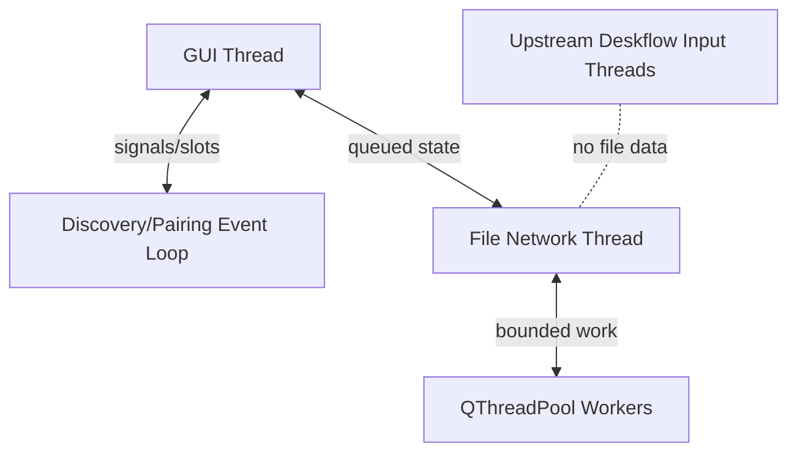

# 02 系统架构

## 1. 总体架构



## 2. 进程策略

P0 优先保持上游进程模型，不新建常驻系统服务：

- GUI：显示设备、设置、配对、传输中心。
- deskflow core：保留现有键鼠 Server/Client。
- 文件传输：首版作为同一产品中的独立 QObject 子系统，使用独立线程/事件循环和 socket。
- 平台后台/daemon：遵循上游现状，不为文件传输重新发明 daemon。

只有真实压测证明同进程故障隔离不足时，才通过 ADR 决定拆分独立进程。

## 3. 组件

### DeviceIdentity

职责：

- 生成和读取 `deviceId`；
- 管理显示名、平台、架构和版本；
- 加载/创建 TLS 身份；
- 计算证书指纹；
- 不暴露私钥给 UI。

### DiscoveryService

职责：

- 监听/发送局域网发现消息；
- 多网卡和地址变化；
- 维护短期在线设备；
- 不负责永久信任；
- 不自动建立未经配对的文件会话。

### PairingManager

职责：

- 六位码生命周期；
- 六位确认码生命周期；
- 双方交换并确认设备与指纹；
- 写入 TrustedDeviceStore。

### TrustedDeviceStore

职责：

- deviceId → pinned fingerprint；
- 设备别名、自动接收、最后地址、撤销状态；
- 原子保存；
- 不保存明文配对码。

### DeskflowIntegration

职责：

- 读取上游当前连接状态；
- 关联 Deskflow computer name 与 RelayDesk deviceId；
- 把屏幕布局、Server/Client 状态展示到统一 UI；
- 不把文件传输塞进 Deskflow 输入包。

### FileTransferManager

职责：

- 对外业务 API；
- offer/accept/reject；
- 任务队列和生命周期；
- 将网络、扫描、I/O、校验组合起来；
- 向 UI 发只读状态信号。

### FileTransferSession

每个 peer connection 一个 session：

- TLS 握手和 pinning；
- capability negotiation；
- frame codec；
- stream/transfer 路由；
- heartbeat 和超时；
- backpressure；
- 连接断开时冻结任务。

### ManifestBuilder

- 异步扫描文件和目录；
- 生成规范化相对路径；
- 拒绝/记录符号链接与特殊文件；
- 收集 size、mtime、可选 hash；
- 对文件数、目录深度和总元数据设限。

### TransferSender / TransferReceiver

- 逐块读取/写入；
- 维护 offset；
- 响应 pause/cancel；
- 计算 SHA-256；
- 检测源文件变化；
- 不访问 UI。

### ResumeStore

- 每任务独立 `.resume.cbor`；
- 原子更新；
- 记录 manifest 摘要、已确认偏移、目标文件映射；
- 启动时扫描并恢复；
- 过期清理。

### TransferHistoryStore

- 有界历史；
- 仅元数据：设备、时间、数量、字节、结果、错误；
- 不保存文件内容；
- 允许清空。

### PathPolicy

唯一安全落盘入口：

- 协议相对路径标准化；
- 平台合法性；
- Windows 保留名/ADS；
- 目录深度、组件长度、总长度；
- 根目录约束；
- 默认接收根目录约束，链接类条目 P0 跳过；
- 冲突命名。

## 4. 线程模型



规则：

- GUI thread 只处理短操作和模型更新。
- `QSslSocket` 归属专用 network thread。
- 目录扫描、SHA-256、磁盘读写由有界 worker 完成。
- worker 返回块时必须尊重 socket 高水位。
- input thread 与 file thread 不共享无界队列。
- 每个任务状态由单 owner 修改，其他线程通过命令消息交互。

## 5. 状态机

### Peer session

```text
Disconnected
  -> Connecting
  -> TlsHandshake
  -> AuthenticatingPinnedPeer
  -> CapabilityExchange
  -> Ready
  -> Draining
  -> Disconnected

任何状态 -> Failed -> Backoff -> Connecting
证书指纹不匹配 -> 提示重新配对
```

### Transfer

```text
Preparing
 -> Offered
 -> WaitingForAcceptance
 -> Queued
 -> Transferring
 -> Verifying
 -> Committing
 -> Completed

Transferring <-> Paused
网络中断 -> Interrupted -> Resuming -> Transferring
任意非终态 -> Cancelling -> Cancelled
任意非终态 -> Failed
```

## 6. 数据路径

### 发送

1. UI 选择目标和路径。
2. Manager 创建任务 UUID。
3. ManifestBuilder 扫描并应用 PathPolicy。
4. Manager 发 `TRANSFER_OFFER`。
5. 对端接受并返回冲突/可续传信息。
6. Sender 按 receiver window 读取块。
7. Codec 生成帧，socket 写入。
8. 对端 checkpoint 后更新 sender state。
9. 所有文件结束，发送 transfer complete。

### 接收

1. 验证 peer 已信任。
2. 校验 offer 和资源限制。
3. 用户接受/策略自动接受。
4. 在 `.incoming/<transferId>` 创建安全 staging。
5. 按 offset 写 `.part`。
6. 文件完成后校验 SHA-256。
7. 根据冲突策略原子提交。
8. 更新历史并通知 UI。

## 7. 存储布局

逻辑布局；实际路径使用 `QStandardPaths`：

```text
AppData/RelayDesk/
├── identity/
│   ├── device.json
│   ├── certificate.pem
│   └── private-key.pem        # 平台权限保护，不进日志/仓库
├── trust/
│   └── trusted-devices.json
├── transfers/
│   ├── active/<transferId>.resume.cbor
│   └── history.jsonl
├── config/
│   └── product.json
└── logs/
```

接收目录：

```text
Downloads/RelayDesk/
└── .incoming/<transferId>/
```

## 8. 公共接口草案

```cpp
class IFileTransferService : public QObject {
    Q_OBJECT
public:
    virtual TransferId send(
        const DeviceId& target,
        const QList<QUrl>& localItems,
        const SendOptions& options) = 0;

    virtual void accept(const TransferId&, const ReceiveOptions&) = 0;
    virtual void reject(const TransferId&, RejectReason) = 0;
    virtual void pause(const TransferId&) = 0;
    virtual void resume(const TransferId&) = 0;
    virtual void cancel(const TransferId&) = 0;

signals:
    void transferAdded(TransferSnapshot);
    void transferChanged(TransferSnapshot);
    void incomingOffer(IncomingOffer);
};
```

UI 只能调用服务接口，不持有 socket、QFile 或 worker。

## 9. 依赖方向

```text
GUI
  -> Application Services
      -> Domain / Protocol
          -> Qt Core

Infrastructure
  -> Domain / Protocol
  -> Qt Network / Qt Core

Platform adapters
  -> Application interfaces
  -> OS APIs
```

禁止：

- Domain include Windows/Cocoa 头；
- UI include `QSslSocket`；
- 网络层决定接收 UI 文案；
- 平台层自行定义第二套传输协议；
- ResumeStore 直接操作 GUI。
