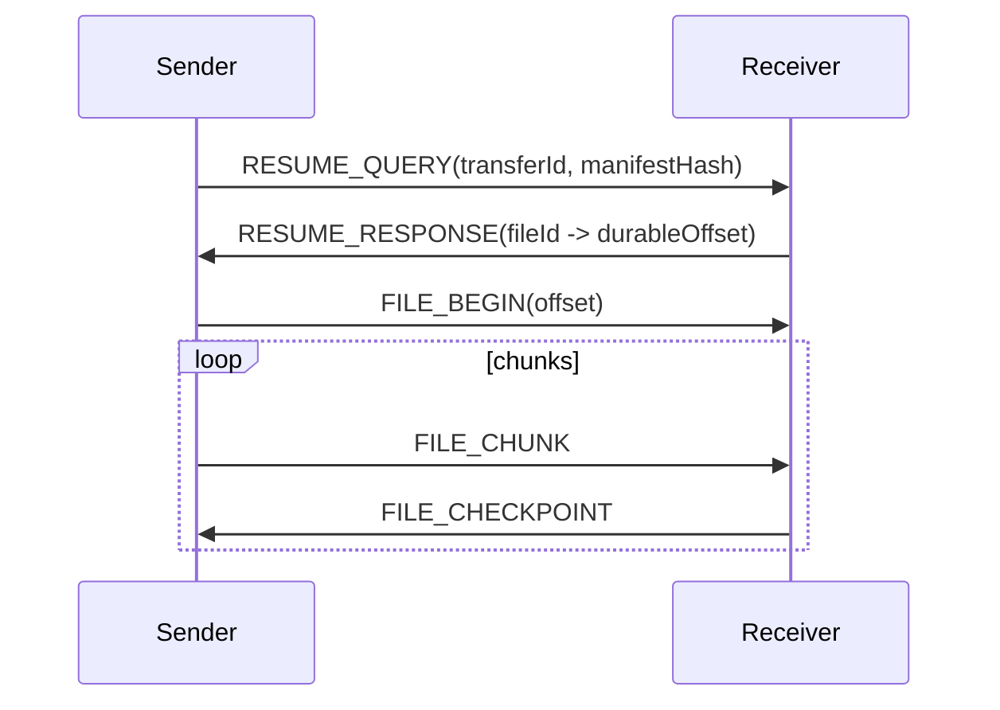

# 05 RelayDesk File Transfer Protocol v1

状态：Draft for implementation  
标识：`RDFT/1`  
传输：TLS over TCP  
控制元数据：CBOR  
文件数据：Binary payload  
整数：Network byte order

规范化 schema 见：

- `spec/protocol/file-transfer-v1.md`
- `spec/protocol/messages.cddl`
- `spec/protocol/test-vectors.json`

## 1. 原则

- 与 Deskflow 输入协议隔离。
- 只在已配对且证书 pinning 通过的 peer 间运行。
- 支持增量解析、半包、粘包和反压。
- 协议层不依赖 UI。
- 消息有明确上限。
- 未知 optional capability 可忽略，未知必需消息导致明确错误。
- 所有状态转换可测试。

## 2. 固定帧头

共 32 字节：

| Offset | Size | Field | 类型 |
|---:|---:|---|---|
| 0 | 4 | magic | ASCII `RDFT` |
| 4 | 2 | version | uint16，v1=`1` |
| 6 | 2 | messageType | uint16 |
| 8 | 4 | flags | uint32 |
| 12 | 4 | metadataLength | uint32 |
| 16 | 8 | payloadLength | uint64 |
| 24 | 8 | streamId | uint64 |

随后：

```text
[32-byte header][CBOR metadata][binary payload]
```

限制默认值：

- metadata ≤ 1 MiB；
- 单帧 payload ≤ 4 MiB；
- discovery 不使用此帧；
- manifest 太大时按页发送；
- 总路径数默认 ≤ 100,000；
- 单相对路径 UTF-8 ≤ 4,096 bytes；
- 深度默认 ≤ 128；
- 总任务大小由磁盘和策略决定，但 uint64 溢出必须检查。

## 3. 消息类型

```text
0x0001 HELLO
0x0002 AUTH_RESULT
0x0003 CAPABILITIES
0x0004 HEARTBEAT
0x0005 HEARTBEAT_ACK

0x0100 TRANSFER_OFFER
0x0101 TRANSFER_ACCEPT
0x0102 TRANSFER_REJECT
0x0103 MANIFEST_PAGE
0x0104 MANIFEST_COMPLETE

0x0200 FILE_BEGIN
0x0201 FILE_CHUNK
0x0202 FILE_CHECKPOINT
0x0203 FILE_END
0x0204 FILE_RESULT

0x0300 TRANSFER_PAUSE
0x0301 TRANSFER_RESUME
0x0302 TRANSFER_CANCEL
0x0303 TRANSFER_COMPLETE
0x0304 TRANSFER_RESULT

0x0400 RESUME_QUERY
0x0401 RESUME_RESPONSE

0x7FFE ERROR
0x7FFF GOODBYE
```

## 4. Flags

```text
0x00000001 ACK_REQUIRED
0x00000002 RESPONSE
0x00000004 FINAL
0x00000008 RETRYABLE
0x00000010 COMPRESSED_METADATA   # P0 默认不用
0x00000020 RESERVED
```

文件 payload P0 不做协议层压缩；用户文件可能已压缩，压缩会浪费 CPU 并影响输入体验。

## 5. 标识

- `sessionId`: 每次 TLS session UUID；
- `transferId`: 一次发送任务 UUID；
- `fileId`: manifest 内稳定 UUID；
- `streamId`: 64-bit connection-local stream；
- `sequence`: stream 内递增 uint64；
- `offset`: 文件字节偏移 uint64。

UUID 在线路上使用 16-byte byte string，不用文本。

## 6. HELLO

元数据：

```cbor
{
  1: h'device-id',
  2: h'session-id',
  3: "0.1.0",
  4: [1],
  5: h'certificate-fingerprint',
  6: 1730000000000
}
```

收到 HELLO 后必须：

- 校验 TLS peer 指纹与 deviceId trust mapping；
- 校验 protocol version 交集；
- 校验时间只用于诊断，不作为唯一安全依据；
- 回 CAPABILITIES。

## 7. CAPABILITIES

```cbor
{
  1: ["file.v1", "folder.v1", "resume.v1", "sha256"],
  2: 1048576,
  3: 4194304,
  4: 2,
  5: 2,
  6: 100000,
  7: ["auto-rename", "overwrite", "skip", "ask"]
}
```

双方取交集和较小限制。

## 8. TRANSFER_OFFER

```cbor
{
  1: h'transfer-id',
  2: "Project",
  3: 1234567890,
  4: 42,
  5: 8,
  6: h'manifest-sha256',
  7: 1,
  8: "ask",
  9: 1730000000000
}
```

字段：

1. transferId
2. displayName
3. totalBytes
4. fileCount
5. directoryCount
6. manifest hash
7. manifest page count
8. requested conflict policy
9. createdAt ms

接收端在 manifest 完整校验前不能开始写文件。

## 9. Manifest

每项：

```cbor
{
  1: h'file-id',
  2: "root/src/main.cpp",
  3: 0,
  4: 8192,
  5: 1730000000000,
  6: h'sha256-or-empty',
  7: 0
}
```

类型：

- 0 file
- 1 directory

P0 不传：

- symlink；
- socket；
- FIFO；
- device；
- hard-link 语义；
- ACL；
- Windows ADS；
- macOS resource fork/xattr。

manifest entry 必须先通过 sender PathPolicy；receiver 再独立验证，不能信任 sender。

## 10. ACCEPT / REJECT

Accept：

```cbor
{
  1: h'transfer-id',
  2: "auto-rename",
  3: "Downloads/RelayDesk",
  4: 98765432100,
  5: false
}
```

接收端不得把绝对目标路径发送给对端作为控制依据；可只发送逻辑目录名。日志和 UI 可本地显示完整路径。

Reject reason：

```text
1 USER_REJECTED
2 NOT_TRUSTED
3 POLICY_DENIED
4 INSUFFICIENT_SPACE
5 TOO_MANY_FILES
6 PATH_INVALID
7 UNSUPPORTED_CAPABILITY
8 BUSY
9 INTERNAL_ERROR
```

## 11. FILE_BEGIN

```cbor
{
  1: h'transfer-id',
  2: h'file-id',
  3: 13743895347,
  4: 0,
  5: 1048576,
  6: h'expected-sha256'
}
```

- offset 可以是 resume point；
- receiver 必须确认 offset 与本地 `.part` 一致；
- 不一致时以 receiver 安全状态为准，必要时从 0 重传。

## 12. FILE_CHUNK

metadata：

```cbor
{
  1: h'transfer-id',
  2: h'file-id',
  3: 0,
  4: 1
}
```

字段 3=offset，4=sequence；payload=原始字节。

接收规则：

- `payloadLength` 必须 ≤ negotiated chunk；
- offset 必须等于当前期望值，除非协议扩展明确支持乱序；
- P0 顺序写，不允许任意稀疏写；
- 写盘成功后才推进 durable offset；
- checkpoint 可按字节/时间发送，默认 8 MiB 或 1 秒。

## 13. FILE_END / RESULT

Sender FILE_END：

```cbor
{
  1: h'transfer-id',
  2: h'file-id',
  3: 13743895347,
  4: h'sha256'
}
```

Receiver：

1. flush/close；
2. 验证 size；
3. 计算/完成 SHA-256；
4. 检查冲突策略；
5. 原子移动；
6. 回 FILE_RESULT。

Result：

```text
0 OK
1 HASH_MISMATCH
2 SIZE_MISMATCH
3 SOURCE_CHANGED
4 TARGET_EXISTS
5 DISK_FULL
6 PERMISSION_DENIED
7 PATH_INVALID
8 IO_ERROR
9 CANCELLED
```

## 14. Pause / Resume / Cancel

- Pause：停止生成新 chunk，已在 socket 的数据允许 drain。
- Resume：包含期望的 transfer/file offset。
- Cancel：双方停止任务，receiver 根据用户选项删除或保留 `.part`。
- Cancel 必须幂等。
- UI 连续点击不能造成非法状态。

## 15. 断线续传

新 session Ready 后：



Receiver 返回的是已写入且可恢复的 durable offset，不是仅收到 socket 的 offset。

为了简单可靠，重启后可重新散列 `.part` 的既有字节，再继续；不要序列化 OpenSSL 内部 hash context。

## 16. 连接与反压

- 监测 `bytesToWrite()`；
- 超过高水位时暂停 worker 读取；
- 低于低水位后恢复；
- 控制帧优先于数据帧；
- 每 peer 有有界发送队列；
- 不复制多份大块；
- 可使用共享/移动 buffer；
- socket 错误冻结任务并持久化状态。

## 17. Error

```cbor
{
  1: 1002,
  2: "INVALID_FRAME_LENGTH",
  3: false,
  4: h'transfer-id-or-null',
  5: h'file-id-or-null'
}
```

错误码分组：

- 1000 protocol；
- 2000 auth/trust；
- 3000 manifest/path；
- 4000 storage/io；
- 5000 transfer state；
- 6000 resource limit；
- 9000 internal。

远端错误文本只用于日志，不直接当富文本显示，防止 UI 注入。

## 18. 版本兼容

- 固定帧 version 是 major。
- CBOR 未知整数 key 可忽略。
- required capability 不支持时 reject。
- 修改字段语义必须升 major 或增加新 key/capability。
- 测试向量是兼容性契约。
